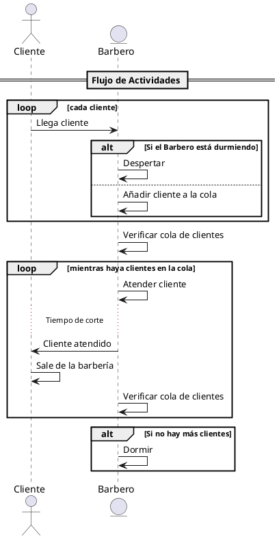

# Actividad: El Problema del Barbero Dormilón en Java

* [1. Objetivo](#1-objetivo)
* [2. Contexto](#2-contexto)
* [3. Requisitos](#3-requisitos)
* [4. Tareas](#4-tareas)
* [5. Esquema para Trabajar](#5-esquema-para-trabajar)
* [6. Entrega](#6-entrega)
* [7. Referencias](#7-referencias)

## 1. Objetivo

Implementar una solución al clásico problema de concurrencia del barbero dormilón utilizando mecanismos de concurrencia en Java, como hilos ([`Thread`][Thread]), bloqueos reentrantes ([`ReentrantLock`][ReentrantLock]), variables de condición ([`Condition`][Condition]), y semáforos ([`Semaphore`][Semaphore]).

## 2. Contexto

En una barbería hay un barbero, una silla de barbero, y N (Para este ejemplo 5) sillas para los clientes esperar si el barbero está ocupado. Si no hay clientes, el barbero se sienta en la silla y se duerme. Cuando llega un cliente, este tiene que despertar al barbero si está dormido o, si el barbero está atendiendo a otro cliente, esperar en una de las sillas disponibles. Si todas las sillas están ocupadas, el cliente se va.

## 3. Requisitos

1. **Barbero y Clientes:** Deben ser representados por hilos separados.
2. **Sincronización:** Utiliza [`ReentrantLock`][ReentrantLock] y [`Condition`][Condition] para sincronizar el acceso a la silla del barbero y la espera de los clientes.
3. **Entrada Aleatoria:** Los clientes deben llegar en momentos aleatorios, por ejemplo entre 5 y 10 segundos.
4. **Tiempo de Corte Aleatorio:** El barbero toma un tiempo aleatorio para cortar el cabello a cada cliente. Entre 10 y 15 segundos.
5. **Cola de Espera:** Implementa una cola para gestionar los clientes que esperan. Esta cola en una primera aproximación puede realizarse como lo que hemos visto en clase de utilizar una [`LinkedList`][LinkedList] por ejemplo, pero en el desarrollo se va a proponer una solución más eficiente.

## 4. Tareas

1. **Diseñar la Barbería:** Crea clases para representar la barbería, el barbero, y los clientes. Usa una [`Semaphore`][Semaphore] para la cola de espera de los clientes.
2. **Implementar la Lógica de Sincronización:** Usa [`ReentrantLock`][ReentrantLock] para proteger el acceso a la silla del barbero y [`Condition`][Condition] para manejar el sueño y el despertar del barbero, así como la espera de los clientes.
3. **Simular Entradas y Tiempos Aleatorios:** Utiliza la clase [`ThreadRandom`][ThreadLocalRandom] para simular la llegada aleatoria de clientes y el tiempo que toma cada corte de cabello.
4. **Probar la Solución:** Asegúrate de que tu solución maneje correctamente situaciones como el barbero durmiendo cuando no hay clientes, clientes esperando cuando el barbero está ocupado, y clientes yéndose cuando no hay sillas disponibles.

## 5. Esquema para Trabajar

## 6. Entrega

Tu programa debe compilar y ejecutarse sin errores, mostrando en la consola el flujo de eventos en la barbería (por ejemplo, llegada de clientes, el barbero cortando el cabello, clientes esperando o yéndose).

## 7. Referencias

* [Thread]
* [ReentrantLock]
* [Condition]
* [Semaphore]
* [ThreadLocalRandom]
* [LinkedList]

[Thread]: https://docs.oracle.com/javase/8/docs/api/java/lang/Thread.html
[ReentrantLock]: https://docs.oracle.com/javase/8/docs/api/java/util/concurrent/locks/ReentrantLock.html
[Condition]: https://docs.oracle.com/javase/8/docs/api/java/util/concurrent/locks/Condition.html
[Semaphore]: https://docs.oracle.com/javase/8/docs/api/java/util/concurrent/Semaphore.html
[ThreadLocalRandom]: https://docs.oracle.com/javase/8/docs/api/java/util/concurrent/ThreadLocalRandom.html
[LinkedList]: https://docs.oracle.com/javase/8/docs/api/java/util/LinkedList.html
